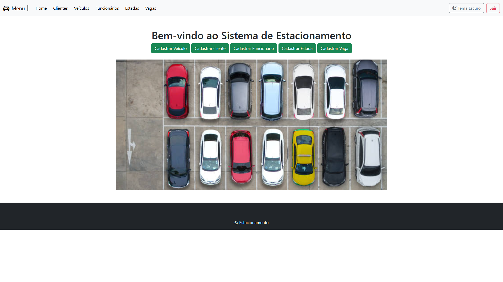

# 🤖 Projeto Integrador

Trabalho com [Django](https://www.djangoproject.com/) 🕸️

---

## 🚀 Como Usar

1. **Crie e ative o [ambiente virtual](https://docs.python.org/pt-br/3/library/venv.html)** 🐍

💻 **Linux/WSL**:

```bash
python3 -m venv .venv
source .venv/bin/activate
```

🪟 **Windows**:

```bash
python -m venv .venv
.\.venv\Scripts\Activate
```

---

2. **Instale as dependências** 📦

```bash
pip install -r requeriments.txt
```

---

3. **Execute as migrações e inicie o servidor** 🛠️

```bash
python manage.py makemigrations
python manage.py migrate
python manage.py runserver
```

---


